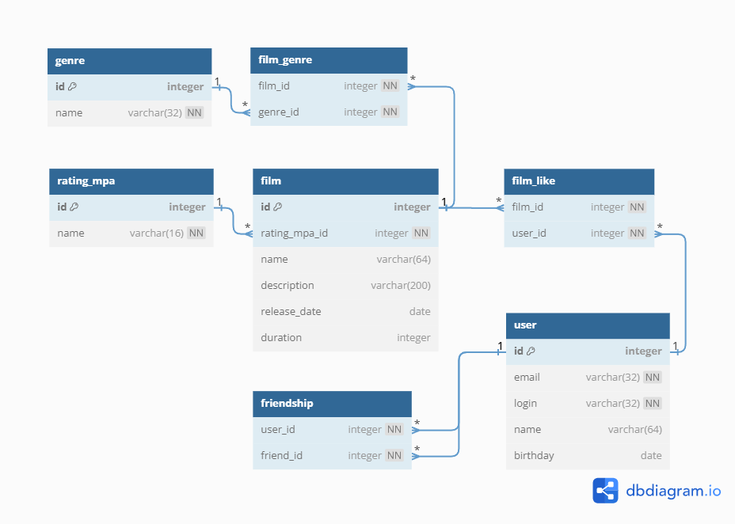

# Filmorate 

### Репозиторий API социальной сети filmorate.

Рисунок 1.1 — Диаграмма базы данных API.

На диаграмме изображены таблицы и виды их связей:
* **_Таблица user_** — содержит информацию о пользователях;
* **_Таблица film_** — содержит информацию о фильмах;
* **_Таблица rating_mpa_** — содержит набор доступных рейтингов [MPA](https://www.motionpictures.org/):
1. G;
  2. PG;
  3. PG-13;
  4. R;
  5. NC-17;
* **_Таблица genre_** — содержит набор доступных жанров:
1. Комедия;
  2. Драма;
  3. Мультфильм;
  4. Триллер;
  5. Документальный;
  6. Боевик;
* **_Таблица film_genre_** — содержит идентификаторы фильмов и их жанров;
* **_Таблица film_like_** — содержит идентификаторы фильмов, получивших лайк(-и) от пользователя;
* **_Таблица friendship_** — содержит идентификаторы пользователей, добавивших друга либо получивших заявку.